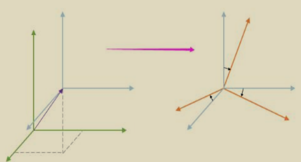

# GIS坐标系

## 前言

GIS中的重中之重便是坐标系，“工作底图平面坐标系应采用国家大地坐标系 CGCS2000，投影方式采用高 斯-克吕格投影，高程基准采用 1985 国家高程基准。”从这句话我们可以得到平面坐标系、CGCS2000、投影 方式、高斯-克吕格投影几个关键词。这些关键词都有什么含义呢，我们慢慢来探究。

## 2.1 地球空间模型：大地椭球体

为什么要建立模型：

​				地球既不是正圆，也不是规则的椭圆

​				地球的自然表面不是光滑的，是崎岖不平的

因此，我们需要对地球表面的做第一层抽象“大地水准面“即得到了一个连续、闭合的 地球表面。再在大地水准面的基础上可以建立地球椭球模型。有了对地球的抽象“大地椭球 体”就可以建立地理坐标系了

地球椭球体有3个参数，长半轴，短 半轴和扁率。 可以想象地球椭球体就是一个没有 那么扁长的橄榄球的形状。

## 2.2 GIS的坐标系概览

| 划分角度       | 坐标系                       |                                   |
| -------------- | ---------------------------- | --------------------------------- |
| 原点与质心关系 | 参心大地坐标系               | (已经被淘汰)                      |
|                | 地心大地坐标系               | (目前通用的)                      |
|                |                              |                                   |
| 表示形式       | 地理坐标系 GCS               | 大地坐标系/经纬度坐标系 （LBH）   |
|                |                              | 空间直角坐标系/地心坐标系 （XYZ） |
|                |                              |                                   |
|                |                              | 高斯-克吕格投影（横轴墨卡托投影） |
| 表示形式       | 投影坐标系PCS （XY平面坐标） | 通用横轴墨卡托（UTM）投影         |
|                |                              | 墨卡托投影                        |
|                |                              | WebMercator投影坐标系             |

PCS=GCS+投影方式

## 2.3 地心坐标系与参心坐标系

### （1）

**地心坐标系：**原点与地球质心重合，以地球质心为原点建立的空间直角坐标系，或参考椭球 中心与地球质心重合的地球椭球面为基准面所建立的大地坐标系

**参心坐标系（被淘汰）：**原点与某一地区或国家所采用的参考椭球中心重合，通常与地球质 心不重合。区域性大地坐标系，只适合地球局部区域使用。

**参心坐标系**
参考椭球面在某一国家、地区内与大地水准面最佳吻

​		合局部坐标系
​		适用于局部范围的测量计算
**地心坐标系**
​		参考椭球面在全球范围内与大地水准面最佳吻合

​		全球坐标系
​		适用于全球范围的测量计算

## 2.4 大地坐标系

GIS坐标系中的椭球，如果加上高程系，在其内涵上就是GCS（地理坐标系统）

参考椭球上的点、线、面

***椭球中心***   ***短轴***  ***大地子午面***（ 首大地子午面（线）） ***大地赤道面***  ***法线***

**参考椭球面和法线是大地坐标的基准面和基准线！**

### （2）

**大地坐标系的定义**

​	**大地经度(L)**:过地面点的子午面与起始子 午面之间的夹角，0°~±180°

​	**大地纬度(B)**：过地面点的法线与赤道面之 间的夹角，0°~±90°

​	**大地高(H)**：地面点沿法线至参考椭球面的距离， 可正可负

经纬度表现形式有两种：  度分秒（如113°12′ 34″）

​										 十进制（如113.534532）

**转换公式：十进制= 度 + 分/60 + 秒/3600**

## 2.5 空间直角大地坐标系(地心坐标系)

在卫星大地测量中，常采用空 间大地直角坐标系来确定地面点的 三维坐标。空间直角坐标系的坐标 原点位于参考椭球的中心，Z轴与椭 球的旋转轴一致，指向参考椭球的 北极; X轴指向起始子午面与赤道的 交点，Y轴位于赤道面上，按右手系 与X轴正交成90“夹角。

P点坐标（X, Y, Z）

## 2.6 投影坐标系PCS

将地球椭球面上的点映射到平面上的方法， 称为地图投影。即曲面变平面

**为什么要进行投影？**

1、 投影地图为平面，符合视觉心理

2、 地球椭球体为不可展曲面

3、 球面坐标不方便进行距离、方位、 面积等参数的量算和各种空间分析

由于地球是一个不规则球体，要转换到平面上必须要经过变形或破裂处理，因此，完全没 有变形误差的地图是不存在的。为了满足不同的实际需要，使误差尽可能小，就产生了各种不 同的投影方式。按变形情况的不同，可以分为等角、等积和任意投影三种。等角投影是保持角 度和形状不变，而面积变形的地图；等积投影则正好与等角投影相反；任意投影则是两种变形 都有

**选择地图投影时，主要考虑因素：**

（1）制图区域的范围、形状和地理位置

（2）地图的用途、出版方式及其他特殊要求

目前绘制地图常用的投影方法达二十多种。

### 目前常用的投影

中国地形图投影：Lamber（兰伯特）投影

各省市的投影：Albers（阿伯斯）投影

在城市级或小范围区域（规划局、国土局、 建设局、工程报建）：局部高斯投影 （ 以便与地方地形图测绘、若是强制按某带投影，则远离 中央经线的区域的角度、距离、面积全部变形严重）

互联网上公众地图网站：Web墨卡托

卫星影像数据： UTM投影

| 地图类型                               | 所用投影                                                     | 主要技术参数                                                 |
| -------------------------------------- | ------------------------------------------------------------ | ------------------------------------------------------------ |
| 中国全图                               | 斜轴等面积方位投影斜轴等角方位投影                           | 投影中心: j=27°30').=+105°或j=30°30').=+105°或j=35°00').=+105° |
| 中国全图 (南海诸岛做插曲图)        | 正轴等面积割圆锥投影 (Albers投影)                        | 标准纬线: j1=25°00'，j2=47°00                            |
| 中国分省(区)地图 (海南省除外)      | 正轴等角割圆锥投影(Lambert 投影)正轴等面积割圆锥投影 (Albers投影) | 各省(区)图分别采用 各自标准纬线                          |
| 中国分省(区)地图 (海南省)          | 正轴等角圆柱投影(Mercator投影)                               |                                                              |
| 国家基本比例尺地形图系列1:100万        | 正轴等角割圆锥投影(Lambert 投影)                             | 按国际统一4°x6°分幅， 标准纬线:j1=js+35' j2=jn+35'   |
| 国家基本比例尺地形图系列1:5万~1:50万   | 高斯一克吕格投影 (6°分带)                                | 投影带号(N):13~23 中央经线: 2.0=(6N-3)°              |
| 国家基本比例尺地形图系列1:5000~1:2.5万 | 高斯一克吕格投影 (3°分带)                                | 投影带号(N):24~46 中央经线: 2.0=(3N)°                |
| 国家基本比例尺地形图系列1:5万~1:50万   | 高斯一克吕格投影 (6°分带)                                | 投影带号(N):11~22中央经线:1.0=(6N-3)°                        |
| 城市图系列(1:500~1:5000)               | 城市平面局域投影或城市局部坐 标的高斯投影                |                                                              |

## 2.7 兰伯特Lambert投影（正轴等角割圆锥投影）

投影方法：圆锥投影通常基于两条标准纬线，从而使其成为割投影。超过标准纬线的纬度间 距将增加。这是唯一常用的将两极表示为单个点的圆锥投影。也可使用单条标准纬线和比例 尺因子定义。如果比例尺因子不等于1.0，投影实际上将变成割投影。 我国1:100万地形图采用了Lambert投影，其分幅原则与国际地理学会规定的全球统 一的国际百万分之一地图投影保持一致。

​		适用于小于（含) 1：100万的地图

​		最适用于中纬度的一种投影。其描绘 形状比描绘面积更准确

## 2.8 高斯-克吕格投影

Gauss-Kruger高斯- 克吕格投影（简称“高斯投影”），又名“横轴等角切圆柱投影”或 “横轴墨卡托投影”，是按分带方法各自进行投影，故各带坐标成独立系统。 中央那条黑线就是投影中心线，与椭圆柱面相切这条线逢360°的因数就可以取，一般多 用3度带（120个）、6度带（60个）。Y方向（赤道方向）前需要加投影带号。

特点： （1）投影后中央子午线为直线，长度不变形，其余 经线投影对称并且凹向于中央子午线，离中央子午线 越远，变形越大。 （2）赤道的投影也是直线，并与中央子午线正交， 其余的纬线投影为凸向赤道的对称曲线。 （3）投影后经纬线仍然持相互垂直，角度无变形。 （4）长度和面积变形很小

## 2.9 通用横轴墨卡托投影（UTM投影）

UTM投影（Universal Transverse Mercator Projection 通用横轴墨卡托投影）是横轴等 角割椭圆柱面投影。 此投影与椭圆柱割地球于南纬80度、北纬84度两条等高圈，投影后两条 相割的经线上没有变形，而中央经线上长度比0.9996（为了保证离中央经线左右约180km处 有两条不失真的标准经线），即 UTM投影=0.9996高斯投影。 此投影系统是美国为了全球 战争需要编制世界各地军用地图和地球资源卫星像片所采用的投影系统。

1、 UTM投影=0.9996高斯投影

2、大地测量和地形测量的投影基础

3、 我国各种遥感影像的常用投影

## 2.10 墨卡托投影

墨卡托(Mercator)投影，是一种“等角正切圆柱投影”，原理是假设地球被围在一中空 的圆柱里，其标准纬线与圆柱相切接触，再假想地球中心有一盏灯，把球面上的图形投影到 圆柱体上，把圆柱体展开，这就是一幅选定标准纬线上的“墨卡托投影”绘制出的地图。 墨卡托投影经纬线横平竖直。经线之间间距相等。形状和角度不变。赤道处面积不变， 纬度越高，面积放大的倍数越大

## 2.11 Web墨卡托投影

Web Mercator（墨卡托）是由Google 最先发明的。在投影过程中，将表示地球的参考椭球 体近似的作为正球体处理（正球体半径 R = 椭球体半长轴 a）。由于墨卡托投影当纬度接近两极 时，y值趋向于无穷大，有些为了方便，就把Y轴的取值范围也限定在X轴相同 范围，搞个正方形地图，而形成了Web Mercator 投影。 目前在互联网上的大部分全国公众地图网站均采用此坐标系。

**投影坐标系范围是**： 最小 ( -20037508.3427892, -20037508.3427892 ) 最大 ( 20037508.3427892, 20037508.3427892 )

**对应的纬度范围是**： 最小 (-180, -85.05112877980659 )， 最大 ( 180, 85.05112877980659 )

## 2.12 当前通用的一些坐标系标准

​	 **国内：**

1. 1985国家高程基准

2. 两个已弃用参心坐标系：北京54、西安80

3. 2000国家大地坐标系（CGCS2000）

4. 火星坐标系(GCJ-02)

**国际：**

1. WGS84坐标系

## 2.13 WGS84坐标系

目前最通用的标准坐标系，平时我们常说的经度纬度多少多少、从GPS 设备、智能手机中取出的数据的坐标系、国际地图提供商使用的坐标系 都是这 个坐标系。 WGS－84坐标系（World Geodetic System）是一种国际上采用的地心 坐标系。坐标原点为地球质心，其地心空间直角坐标系的Z轴指向国际时间局 （BIH）1984.0定义的协议地极（CTP）方向，X轴指向BIH1984.0的协议子午 面和CTP赤道的交点，Y轴与Z轴、X轴垂直构成右手坐标系，称为1984年世界 大地坐标系。这是一个国际协议地球参考系统（ITRS），是目前国际上统一采 用的大地坐标系。GPS广播星历是以WGS-84坐标系为根据的

## 2.14 1985国家高程基准

高程控制网的建立，首先必须建立一个统一的高程基准面，所有水准测量测定的高程都以这 个面为零起算，也就是以高程基准面作为零高程面。用精密水准测量联测到陆地上预先设置 好的一个固定点，定出这个点的高程作为全国水准测量的起算高程，这个固定点称为水准原 点。 “1985国家高程基准”为我国现行通用标准，是从1988年1月1日开始启用的。

## 2.15 两个已弃用的国内参心坐标系

**北京54坐标系(BJZ54) 【已弃用】** 新中国成立以后，我国大地测量进入了全面发展时期，在全国范围内开展了正规的、全面的大 地测量和测图工作，迫切需要建立一个参心大地坐标系。由于当时的“一边倒”政治趋向，故我国 采用了前苏联的克拉索夫斯基椭球参数，并与前苏联1942年坐标系进行联测，通过计算建立了我国 大地坐标系，定名为1954年北京坐标系。因此，1954年北京坐标系可以认为是前苏联1942年坐标 系的延伸。它的原点不在北京而是在前苏联的普尔科沃。

**西安80坐标系(GDZ80)【已弃用，但很多旧地图数据还是此坐标系】** 1978年4月在西安召开全国天文大地网平差会议，确定重新定位，建立我国新的坐标系，为此 有了1980年国家大地坐标系。1980年国家大地坐标系采用地球椭球基本参数为1975年国际大地测 量与地球物理联合会第十六届大会推荐的数据，即IAG 75地球椭球体。该坐标系的大地原点设在我 国中部的陕西省泾阳县永乐镇，位于西安市西北方向约60公里，故称1980年西安坐标系，又简称 西安大地原点。

## 2.16 2000国家大地坐标系（CGCS2000）

随着情况的变化和时间的推移，国内原有的2个以经典测量技术为基础的局部参心大地 坐标系，已经不能适应科学技术特别是空间技术发展，不能适应当今气象、地震、水利、交 通、国防等部门对高精度测绘地理信息服务的要求，而且也不利于与国际上民航与海图的有 效衔接。

2000国家大地坐标系，是我国当前最新的国家大地坐标系，英文名称为China Geodetic Coordinate System 2000，英文缩写为CGCS2000。

2000国家大地坐标系是全球地心坐标系在我国的具体体现，其原点为包括海洋和大气 的整个地球的质量中心。Z轴指向BIH1984.0定义的协议极地方向（BIH国际时间局），X轴 指向BIH1984.0定义的零子午面与协议赤道的交点，Y轴按右手坐标系确定。

***PS：CGCS2000 与 WGS84 相差几个厘米，对于一般工程测量，可以认为二者是一致的。***

## 2.17 四个坐标系的比较

| 坐标系名       | 北京54                | 西安80                                   | WGS84           | CGCS2000                                        |
| -------------- | --------------------- | ---------------------------------------- | --------------- | ----------------------------------------------- |
| 参考椭球       | Krasovsky_1940        | IAG75 (ArcGIS中标注是 Xian_1980椭球) | WGS_1984        | CGCS2000                                        |
| 椭球极半径b    | 6  356 863.0187730473 | 6356755.288158                           | 6356752.314245  | 6356752.314140                                  |
| 椭球赤道半径a  | 6378245.000000        | 6378140.000000                           | 6378137.000000  | 6378137.000000                                  |
| 扁率           | 1/298.3               | 1/298.25722101                           | 1/298.257223563 | 1/298.257222101                                 |
| 参考水准面     | 56黄海                | 85黄海                                   | -               | 85黄海                                          |
| ArcGIS中的名称 | GCS_Beijing_1954      | GCS_Xian_1980                            | GCS_WGS_1984    | GCS China Geodeti c Coordinate Syst em_2000 |
| ArcGIS中WKID   | 4214                  | 4610                                     | 4326            | 4490                                            |

CGCS2000的定义与WGS84实质一样。采用的参考椭球非常接近。扁率差异引起椭球面上的纬度和 高度变化最大达0.1mm。当前测量精度范围内，可以忽略这点差异。可以说两者相容至cm级水平

## 2.18 火星坐标系(GCJ-02)

在我国，出于国家安全考虑， 国内所有导航电子地图必须使用国家测绘局制定的加密坐标系统，即将一个真实的经纬度坐 标加密成一个不正确的经纬度坐标，我们在业内将前者称之为地球坐标，后者称之为火星坐 标(GCJ-02)。

当我们使用的数据和服务不同时，就产生了我们时常说的偏移和纠偏的问题。

**从设备获取经纬度（GPS）坐标：**

（1）如果使用的是ios的原生定位库， 那么获得的坐标是WGS84

（2）如果使用的是高德sdk,那么获取的 坐标是GCJ02

（3）如果使用的是百度sdk那么可以获 得百度坐标（bd09）或者火星坐标 （GCJ02)，默认是bd09

| 坐标系         | 地图服务商                                             |
| -------------- | ------------------------------------------------------ |
| 标准坐标系     | 国外地图服务，天地图(属于CGCS2000，但可以等同于WGS84)  |
| 火星偏移坐标系 | iOS 地图(其实是高德)、Gogole地图、腾讯地图、高德地图等 |
| 其他偏移坐标系 | 百度地图、搜狐搜狗地图(在火星坐标系上二次加密)         |

## 2.19 坐标系转换

坐标系转换中主要是GCS转GCS，GCS转PCS就是投影， PCS转PCS是重投影。 GCS转GCS这属于空间解析几何里的空间直角坐标系的移动、转换问题，还有个更高级 的说法：仿射变换。 欲将一个空间直角坐标系仿射到另一个坐标系的转换，需要进行平移、 旋转、缩放三步，可以无序进行

平移、旋转又有三个方向上的量，即**平移向量=（dx,dy,dz） 和旋转角度（A,B,C），加上缩放比例s**，完成一个不同的坐 标系转换（比如WGS84转西安80），就需要7参数

地心坐标系是唯一的，即原点唯一，就说明平移向量是0向 量，如果缩放比例是1，那么**旋转角度（A,B,C）**就是唯一的 仿射参数，即3参数

## 2.20

## （1）：**地图比例尺和分辨率**

​		比例尺（ Scale） 即地图上的一厘米代表着实际上的多少厘米。例如地图上1厘米代表实地距离500千米， 可写成：1 ∶ 50,000,000或写成：1/50,000,000。

​		分辨率（ Resolution） 代表当前地图范围内，1像素代表多少地图单位（X地图单位/像素），地图单位取决于 数据本身的空间参考。可见Resolution跟 dpi有关系（dpi代表每英寸的像素数），跟地图 的单位也有关系

​	**图上一像素代表实际距离多少米：**

​		*现在假设地图的坐标单位是米，dpi为96 ；1英寸=2.54厘米；1英寸=96像素； 如果当前地图比例尺为1:125000000，则代表图上1米等于实地125000000米； 米和像素间的换算公式： 1英寸=0.0254米=96像素 , 1像素=0.0254/96 米 则根据1：125000000比例尺，图上1像素代表实地距离是 125000000*0.0254/96 = 33072.9166666667米。*