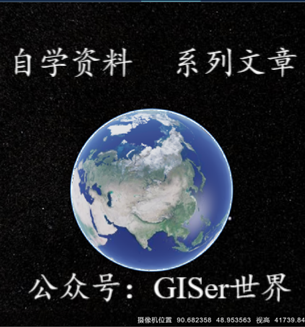

# 📚 GIS开发、升职加薪必备

| Cesium      | GIS       | Java          | 算法               | 深度学习      | JavaScript         | 架构设计    | 设计模式    | 实用技巧    | 开发规范     | 中间件              |
| ----------- | ----------- | ----------- | ------------------- | ----------- | ----------- | ----------- | ----------- | ----------- | ------------ | ------------------- |
| [☕](#nav-1) | [💻](#nav-1) | [☁️](#nav-3) | [✏️](#nav-4) | [💾](#nav-5) | [📐](#nav-6) | [👑](#nav-7) | [🎯](#nav-8) | [🔧](#nav-9) | [📘](#nav-10) | [🚀](#nav-10) |

## 📝 Cesium
- [Cesium发展历史](/Cesium/cesium发展历史.md)
- [Cesium+vue环境搭建](/Cesium/Cesium+vue环境搭建.md)
- [Cesium+Vue3+vite环境搭建](/Cesium/Cesium+Vue3+vite环境搭建.md)
- [Cesium面试题](/Cesium/Cesium面试题.md)
- [Cesium+Vue2环境搭建视频](/Cesium/01/Cesium+Vue2环境搭建视频.md)
- [CesiumAPI以及Viewer](/Cesium/01/CesiumAPI以及Viewer.md)
- [Cesium中DataSource详细介绍及案例](/Cesium/01/Cesium中DataSource详细介绍及案例.md)
- [Cesium中EntityCollection详细介绍](/Cesium/01/Cesium中EntityCollection详细介绍.md)
- [Cesium中material材质](/Cesium/01/Cesium中material材质.md)
- [Cesium中Math介绍](/Cesium/01/Cesium中Math介绍.md)
- [Cesium中图元Primitive详细介绍](/Cesium/01/Cesium中图元Primitive详细介绍.md)
- [Cesium中坐标系介绍](/Cesium/01/Cesium中坐标系介绍.md)

[comment]: <> (- [DevOps初学指南]&#40;/Architect/DevOps初学指南.md&#41;)

[comment]: <> (- [架构师定义、职业素质和应具备的能力]&#40;/Architect/架构师定义、职业素质和应具备的能力.md&#41;)

[comment]: <> (## 💸 涨薪秘籍)

[comment]: <> (- [1.5W字长文讲解分布式系统]&#40;/SalaryIncrease/1.5W字长文讲解分布式系统.md&#41;)

[comment]: <> (- [阿里巴巴10个顶级开源项目]&#40;/SalaryIncrease/阿里巴巴10个顶级开源项目.md&#41;)

## ☕ Java
- [Java发展史](/Java/Java发展史.md)
- [Java基础语法](/Java/Java基础语法.md)
- [Java数组概念](/Java/Java数组概念.md)
- [Java流程控制语句](/Java/Java流程控制语句.md)

[comment]: <> (- [RedisTemplate使用不当导致的线上事故]&#40;/Java/Spring/RedisTemplate使用不当导致的线上事故.md&#41;)

[comment]: <> (- [SpringBoot Starter开发利器：mica-auto]&#40;/Java/SpringBoot/mica-auto.md&#41;)

[comment]: <> (- [SpringBoot接入SkyWalking分布式链路追踪]&#40;/Java/SpringBoot/SpringBoot接入SkyWalking分布式链路追踪.md&#41;)

[comment]: <> (- [SpringBoot统一接口返回和全局异常处理]&#40;/Java/SpringBoot/SpringBoot统一接口返回和全局异常处理.md&#41;)

[comment]: <> (- [还在重复造轮子？hutool一键搞定]&#40;/Java/还在重复造轮子？hutool一键搞定.md&#41;)

[comment]: <> (- [Java如何实现DistinctBy？]&#40;/Java/Java如何实现DistinctBy.md&#41;)

[comment]: <> (- [一文看懂死锁]&#40;/Java/一文看懂死锁.md&#41;)

## 💻 GIS（WebGIS）

- [GIS目录](/GIS/README.md)
## ☁️ 深度学习
- [变分自编码器](/DeepLearning/AutoEncode/变分自编码器.md)

## ✏️ 算法

- [以五子棋为例硬撸稀疏数组](/Algorithm/以五子棋为例硬撸稀疏数组.md)
- [撸一撸限流算法](/Algorithm/撸一撸限流算法.md)

## 💾 JavaScript
- [Vuex](/JS/vue/Vuex.md)

## 📐 UML
- [设计模式（脑图版）](/UML/设计模式（脑图版）.md)
- [UML统一建模语言](/UML/UML统一建模语言.md)
- [UML类图](/UML/UML类图.md)
- [程序员画图神器-PlantUml](/UML/程序员画图神器-PlantUml.md)
- [系统架构设计核心要素（脑图版）](/UML/系统架构设计核心要素（脑图版）.md)

## 👑 架构设计
- [凤凰架构读书笔记-架构演进](/Architecture/凤凰架构读书笔记-架构演进.md)
- [凤凰架构读书笔记-演示工程](/Architecture/凤凰架构读书笔记-演示工程.md)
- [凤凰架构读书笔记-远程服务](/Architecture/凤凰架构读书笔记-远程服务.md)
- [凤凰架构读书笔记-事务处理](/Architecture/凤凰架构读书笔记-事务处理.md)
- [系统架构设计核心要素（大纲版）](/Architecture/系统架构设计核心要素（大纲版）.md)
- [服务限流的思路](/Architecture/服务限流的思路.md)
- [服务降级的思路](/Architecture/服务降级的思路.md)
- [构建高性能Web站点](/Architecture/构建高性能Web站点.md)
- [SpringCloud整体架构](/Architecture/SpringCloud/SpringCloud整体架构.md)
- [DDD系列第一讲：Domain Primitive](/Architecture/DDD/DDD系列第一讲：Domain-Primitive.md)
- [DDD系列第二讲：应用架构](/Architecture/DDD/DDD系列第二讲：应用架构.md)
- [DDD系列第三讲：Repository模式](/Architecture/DDD/DDD系列第三讲：Repository模式.md)
- [DDD系列第四讲：领域层设计规范](/Architecture/DDD/DDD系列第四讲：领域层设计规范.md)
- [DDD系列第五讲：聊聊如何避免写流水账代码](/Architecture/DDD/DDD系列第五讲：聊聊如何避免写流水账代码.md)

## 🎯 设计模式

- [七大设计原则](/DesignPattern/七大设计原则.md)
- [23种设计模式](/DesignPattern/23种设计模式.md)
- [状态模式之订单实战](/DesignPattern/状态模式之订单实战.md)

## 🔧 实用技巧
- [如何用docsify改造你的Github-Pages](/Skill/如何用docsify改造你的Github-Pages.md)
- [docsify进阶使用](/Skill/docsify进阶使用.md)
- [Linux下安装MySQL8.0和重置密码](/Skill/Linux下安装MySQL8.0和重置密码.md)
- [IDEA插件集成](/Skill/IDEA插件集成.md)
- [IDEA实用技巧](/Skill/IDEA实用技巧.md)
- [Sentinel快速接入](/Skill/Sentinel快速接入.md)
- [Nacos快速接入](/Skill/Nacos快速接入.md)
- [Markdown表情符号大全](/Skill/Markdown表情符号大全.md)

## 📘 开发规范
- [阿里巴巴Java开发手册](/Specification/阿里巴巴Java开发手册.md)
- [MySQL数据库开发规范](/Specification/MySQL数据库开发规范.md)
- [写JAVA的好习惯](/Specification/写JAVA的好习惯.md)
- [写SQL的好习惯](/Specification/写SQL的好习惯.md)
- [写SQL的好习惯](/Specification/写SQL的好习惯.md)

## 🚀 中间件
- [如何用RabbitMQ批处理能力优化服务](/Middleware/MQ/如何用RabbitMQ批处理能力优化服务.md)
- [Redis事务](/Middleware/Redis/Redis事务.md)
- [Redis持久化](/Middleware/Redis/Redis持久化.md)
- [Redis分布式锁](/Middleware/Redis/Redis分布式锁.md)
- [Redis的典型应用场景](/Middleware/Redis/Redis的应用场景.md)
- [Redis热key的发现与解决](/Middleware/Redis/Redis热key的发现与解决.md)
- [Redis内存淘汰策略和过期键清除策略](/Middleware/Redis/Redis内存淘汰策略和过期键清除策略.md)
- [Redisson分布式锁的AOP实现](/Middleware/Redis/Redisson分布式锁的AOP实现.md)

## 今年汇总 ✨

